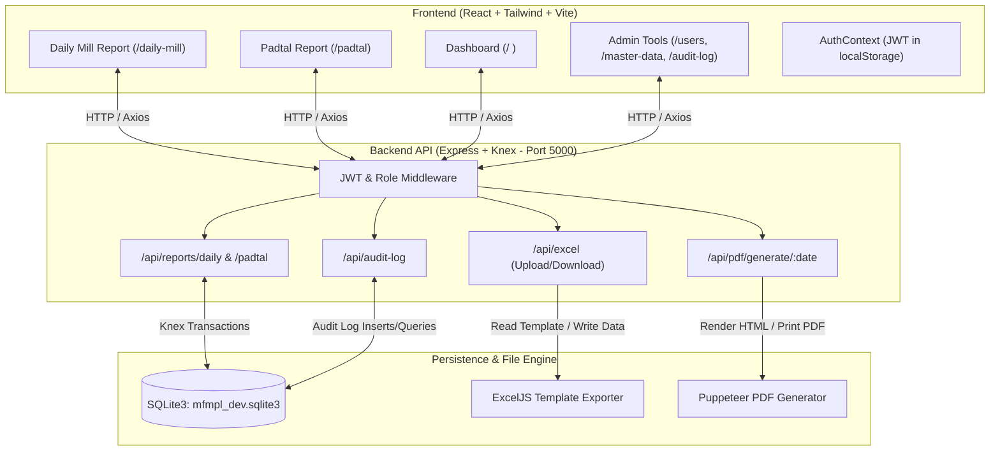
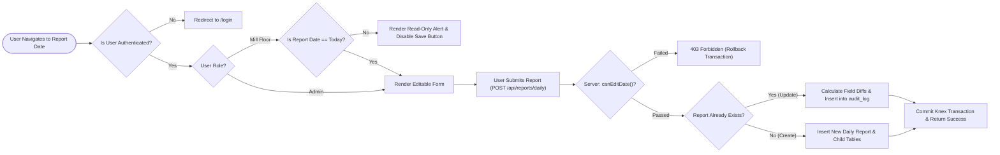
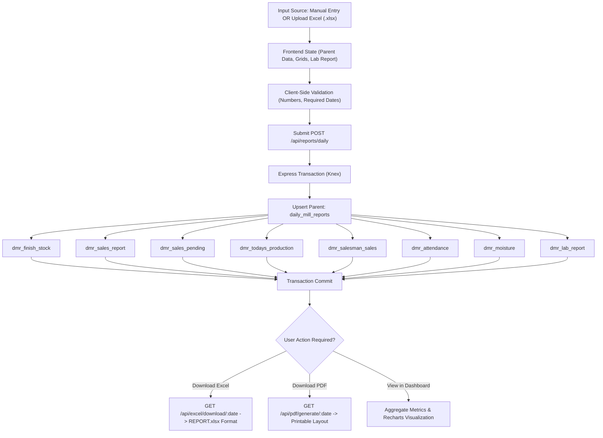

# Manish Flour Mills MIS — Full MVP Architecture & Flowcharts

This document provides a comprehensive overview of the **Manish Flour Mills Pvt. Ltd. (MFMPL) Management Information System (MIS) MVP**, detailing the system architecture, feature set, role-based security model, data structures, and end-to-end visual flowcharts.

---

## 1. Executive Summary & Purpose

The **MFMPL MIS MVP** replaces disconnected, manual spreadsheet reporting with a secure, centralized web application. It is designed to capture daily flour mill operations—including grinding volumes, inventory stocks, sales, attendance, moisture levels, lab quality metrics, and **Padtal** profitability calculations—while preserving **100% export compatibility** with the company's official `REPORT.xlsx` template.

---

## 2. Technology Stack

* **Frontend:** React 18, TypeScript, Vite, Tailwind CSS, Recharts, React Router v6, Axios
* **Backend:** Node.js (ES Modules), Express.js, Knex.js Query Builder & Migrations
* **Database:** SQLite3 (`mfmpl_dev.sqlite3`) with relational foreign keys and transaction support
* **File Processing & Export:** 
  * `exceljs` & `xlsx` for parsing uploaded sheets and generating pixel-perfect `.xlsx` exports
  * `puppeteer` for rendering printable HTML/PDF reports
* **Security & Authentication:** JWT (`jsonwebtoken`), Bcrypt password hashing, custom role-based Express middleware

---

## 3. Comprehensive Feature Set

### A. Role-Based Access Control (RBAC)
* **Admin (`admin@mfmpl.com`):**
  * Full CRUD permissions across all current and historical report dates.
  * Access to system settings, alert thresholds, user management, and master data catalogs.
  * Visibility into field-level **Audit Trails** recording before/after diffs of historical edits.
* **Mill Floor (`mill_floor` role):**
  * Restricted to creating or editing reports for **today's date only**.
  * Past dates automatically switch to **Read-Only Mode** with locked forms.

### B. Daily Mill Report (`/daily-mill`)
* **Parent Operations Data:** Total Mill Grinding, Chakki Grinding, Running/Stop Hours, Power Consumption (Units & Rate), Wheat Stock (Opening, Received, Purchase Rate).
* **Repeating Operational Grids:**
  * **Finish Stock & Today's Production:** Katta and Quintal tracking per flour product.
  * **Sales Report & Pending Sauda:** Katta, Quintals, and Amount per product.
  * **Salesman Sales:** Itemized sales breakdown mapped by Salesman and Product.
  * **Attendance:** Employee headcounts (Total, Present, Absent) across 8 mill departments.
  * **Moisture Testing:** Flour moisture readings (`maida_1`, `maida_2`, and average) with automatic out-of-range visual alerts.
* **Lab Quality Report:** W.P %, Ash %, Gluten %, Sedimentation, and Bread Height (mm).
* **Excel Import/Export:** One-click import from `.xlsx` files and direct download to official formatted `.xlsx` or `.pdf`.

### C. Padtal Costing & Realization Report (`/padtal`)
* Calculates daily milling profitability and flour realization against wheat purchase costs.
* Tracks product yield percentages, rates per bag/kg, and average rates.
* Automatic margin difference calculation against adjusted wheat rates (`wheat_rate * 0.96`).

### D. Executive Dashboard (`/`)
* **Production vs. Sales Analytics:** Multi-bar Recharts visualization of output vs. sales.
* **Power Consumption Trend:** 30-day line chart tracking electrical efficiency.
* **Period A vs. Period B Comparison:** Compare production metrics across two selectable date ranges.
* **Recent Reports Table:** Quick access to view, edit, or download Excel/PDF reports.

### E. Governance & Audit Trail (`/audit-log`)
* Automated audit logging for any updates made to existing reports.
* Captures timestamp, editor email, report date, field name, old value, and new value.

---

## 4. End-to-End System Architecture & Data Flow



---

## 5. Security & Role Workflow Diagram



---

## 6. Daily Mill Report Lifecycle & Processing Flow



---

## 7. Database Entity Schema (Key Tables)

| Table Name | Description | Key Columns |
| :--- | :--- | :--- |
| `users` | System user credentials & roles | `id`, `email`, `password_hash`, `role` (`admin` / `mill_floor`) |
| `daily_mill_reports` | Parent report record per date | `id`, `report_date`, `mill_grinding`, `chakki_grinding`, `power_units`, `wheat_opening` |
| `dmr_finish_stock` | Finished goods inventory | `id`, `report_id`, `product_id`, `katta`, `qtl` |
| `dmr_sales_report` | Daily sales per product | `id`, `report_id`, `product_id`, `katta`, `qtl`, `amount` |
| `dmr_salesman_sales` | Sales breakdown by salesman | `id`, `report_id`, `salesman_id`, `product_id`, `katta`, `qtl`, `amount` |
| `dmr_attendance` | Department headcounts | `id`, `report_id`, `department`, `total`, `present`, `absent` |
| `dmr_moisture` | Flour moisture readings | `id`, `report_id`, `item_name`, `maida_1`, `maida_2`, `average` |
| `dmr_lab_report` | Lab quality testing | `id`, `report_id`, `wp`, `ash`, `gluten`, `sedimentation`, `bread_height` |
| `padtal_reports` | Profitability & wheat rate | `id`, `report_date`, `wheat_rate`, `notes` |
| `audit_log` | Field-level historical change log | `id`, `report_type`, `report_id`, `field_name`, `old_value`, `new_value`, `changed_by_email` |

---

## 8. Verified Local Execution Instructions

1. **Frontend Dev Server:**
   ```bash
   cd "t:/Manish MIS/frontend"
   npm run dev
   # Runs on http://localhost:5173
   ```
2. **Backend API Server:**
   ```bash
   cd "t:/Manish MIS/backend"
   npm start
   # Automatically runs Knex database migrations on startup & listens on port 5000
   ```
3. **Default Seeded Admin Account:**
   * **Email:** `admin@mfmpl.com`
   * **Password:** `admin123`
